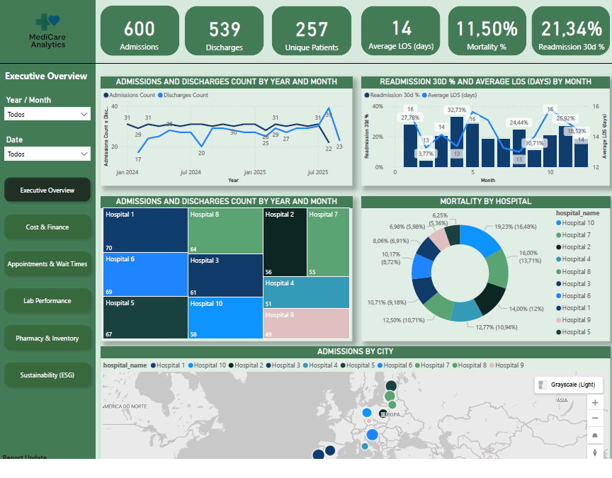
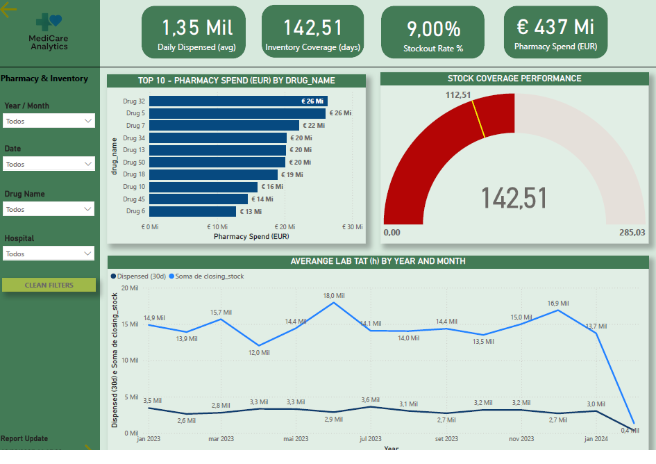
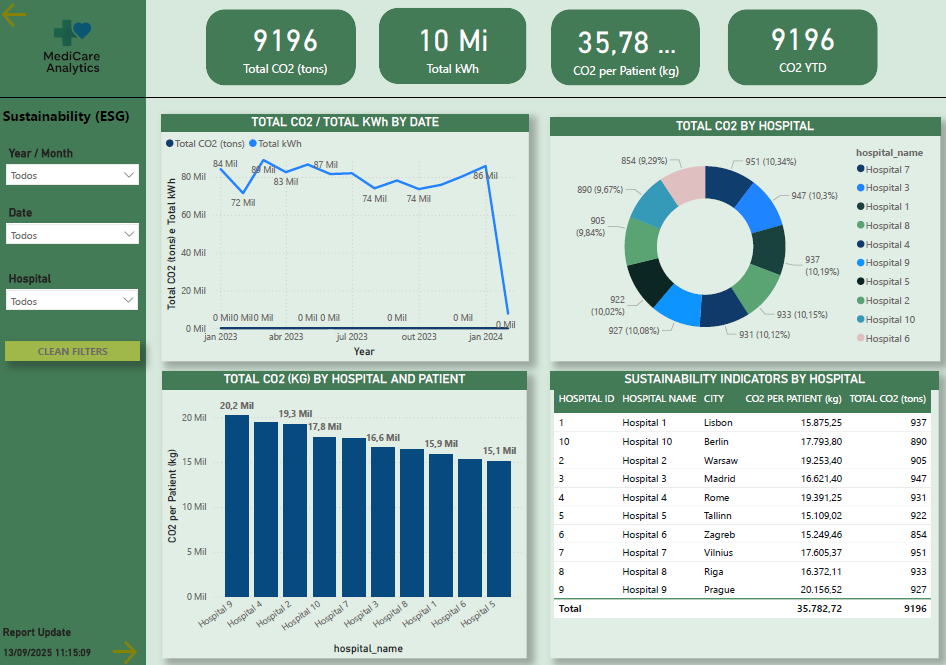

# Healthcare & Pharma – Business Intelligence Dashboard (Demo)

📊 **Overview**  
This project simulates healthcare and pharmaceutical management across a hospital network.  
The goal is to demonstrate expertise in **Power BI, DAX, data modeling, and executive storytelling** applied to the healthcare industry.

---

## 🚀 Features
- **Executive Overview**: Admissions, discharges, mortality, readmission, and inpatients.  
- **Cost & Finance**: Total costs, cost per patient, medication spend, procedures.  
- **Appointments & Wait Times**: Consultations volume, waiting times, and no-show rate.  
- **Lab Performance**: Avg turnaround time (TAT), % within target, test/hospital analysis.  
- **Pharmacy & Inventory**: Stock coverage, stockouts, spend per drug category.  
- **Sustainability (ESG)**: Energy consumption, CO₂ emissions, and environmental impact by hospital.  

---

## 🛠️ Tech Stack
- **Power BI** (DAX, Power Query, tabular modeling)  
- **SQL/CSV** (transactional data simulation)  
- **Python** (automation and synthetic dataset generation)  

---

## 📂 Data Structure
- **Dimensions**  
  - `dim_date` → full calendar (year, month, quarter, day).  
  - `dim_patient` → patient master data.  
  - `dim_doctor` → doctor directory.  
  - `dim_hospital` → hospitals, regions, and capacity (beds).  
  - `dim_labtest` → test catalog with target turnaround time (TAT).  
  - `dim_medication` → drug catalog and unit cost.  

- **Facts**  
  - `fact_admissions` → admissions, discharges, LOS, mortality, readmission.  
  - `fact_costs` → costs per admission (total, medication, procedures).  
  - `fact_appointments` → appointments, attendance/no-show, wait times.  
  - `fact_lab_tests` → laboratory tests and turnaround times.  
  - `fact_med_inventory` → stock levels, dispensing, and stockouts.  
  - `fact_treatments` → treatments and procedures linked to admissions.  
  - `fact_energy_consumption` → energy usage and CO₂ emissions by hospital.  

---

## 🔗 Model Relationships
- `fact_admissions[admission_date]` → `dim_date[date_key]`  
- `fact_admissions[discharge_date]` → `dim_date[date_key]` *(inactive)*  
- `fact_admissions[doctor_id]` → `dim_doctor[doctor_id]`  
- `fact_admissions[hospital_id]` → `dim_hospital[hospital_id]`  
- `fact_admissions[patient_id]` → `dim_patient[patient_id]`  
- `fact_appointments[doctor_id]` → `dim_doctor[doctor_id]`  
- `fact_appointments[hospital_id]` → `dim_hospital[hospital_id]`  
- `fact_costs[admission_id]` → `fact_admissions[admission_id]`  
- `fact_energy_consumption[hospital_id]` → `dim_hospital[hospital_id]`  
- `fact_lab_tests[date_key]` → `dim_date[date_key]`  
- `fact_lab_tests[test_id]` → `dim_labtest[test_id]`  
- `fact_med_inventory[drug_id]` → `dim_medication[drug_id]`  
- `fact_treatments[admission_id]` → `fact_admissions[admission_id]`  

---

## 📊 Key Measures
### Admissions & Patients
- Admissions / Discharges  
- Average LOS (days)  
- Inpatients  
- Mortality %  
- Readmission 30d %  
- Unique Patients  

### Costs
- Total Cost  
- Procedure Cost  
- Medication Cost  
- Cost per Patient (EUR)  

### Appointments
- Appointments  
- Average Wait (min)  
- No-Show Rate %  

### Lab Performance
- Avg Lab TAT (h)  
- TAT within Target %  
- Countrows Lab test  

### Medications
- Dispensed (30d)  
- Daily Dispensed (avg)  
- Inventory Coverage (days)  
- Stockout Rate %  
- Pharmacy Spend (EUR)  

### Occupation
- Patient-days  
- Capacity-days (adj.)  
- Bed Occupancy %  

### Sustainability
- Total kWh  
- Total CO₂ (tons)  
- CO₂ YTD  
- CO₂ per Patient (kg)  

---

## 📸 Preview
  
  
  

---

## 🎯 Key Learnings
- Built **executive KPIs** for healthcare and ESG.  
- Applied **DAX for bed occupancy, TAT, and no-show analysis**.  
- Delivered **storytelling insights** for hospital managers and stakeholders.  
- Designed a **star schema model** for performance with complex healthcare data.  

---

## 📥 File
- [Download Dashboard PDF](./Healthcare_Pharma.pdf)

---

## 👨‍💻 Author
**Leonardo Cabral** – Data Analyst | Power BI | SQL | Healthcare BI  
Certification in progress: **Microsoft PL-300**
